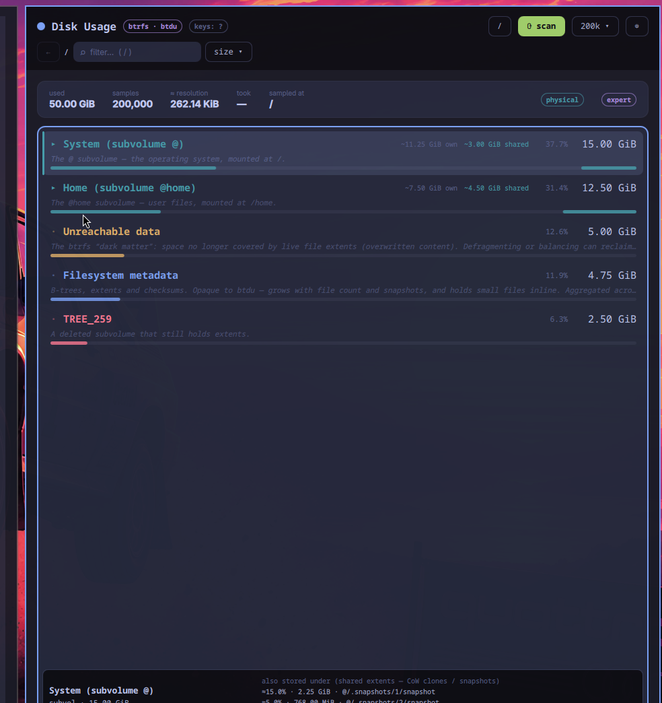

# omarchy_fs_usage — Disk Usage · btdu

An Omarchy-flavored graphical front-end for [btdu], the sampling disk
usage profiler for btrfs, built with the D Qt (QML) bindings.

It drives the real `btdu` CLI tool headlessly (`btdu --headless
--auto-mount --export=…`) and browses the result in an ncdu-style UI:
subvolumes, the `<UNUSED>` "dark matter", orphaned subvolumes and the
opaque buckets (`<METADATA>`, `<SYSTEM>`), merged across block group
profiles, with per-row share-of-space bars. Beyond the tree it has two
advanced tabs: **Insights** (sampling accuracy, snapshot sizes,
unreachable space, compression/physical notes) and **Compare** (disk
usage changes against a saved baseline).

## Disclaimer
This project uses AI-generated content and/or AI-assisted functionality.
AI outputs may be inaccurate, incomplete, or inappropriate. 
Use this project at your own risk and verify important results independently. 
The authors are not responsible for any consequences arising from the use of AI-generated outputs.



* **Theme** — colors follow the active Omarchy theme (`omarchy theme set …`).
* **Privileges** — btdu needs raw device access; the app elevates via `pkexec`.
* **Input** — fully drivable from the keyboard, mouse works too.

## Building

Requirements: a D compiler (ldc or dmd), Dub, Qt 6 development
libraries, and `btdu` at runtime (`sudo pacman -S btdu`, or a build in
the Dub package cache — the app searches `$BTDU_PATH`, then `$PATH`,
then the cache).

```sh
dub build
./omarchy_fs_usage
```

The dqt bindings come from upstream master as a git dependency
(`dub.json`) — nothing to set up.

## Documentation

* [docs/USAGE.md](docs/USAGE.md) — keyboard and mouse reference, scan
  options, the Insights and Compare tabs, offline browsing.
* [docs/DEVELOPMENT.md](docs/DEVELOPMENT.md) — automated tests,
  headless probes, dqt/GC and Qt Quick pointer notes.

## License

MIT — see [LICENSE](LICENSE)

[btdu](https://github.com/CyberShadow/btdu) is GPL-2.0 sampling disk usage profiler for btrfs by CyberShadow

[dqt](https://github.com/tim-dlang/dqt) is LGPL-3.0 D bindings for the Qt Toolkit by Tim Schendekehl
